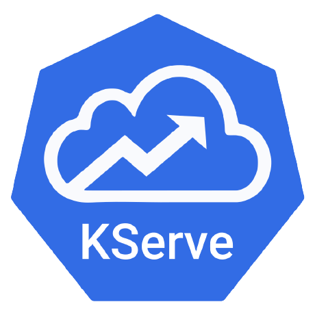
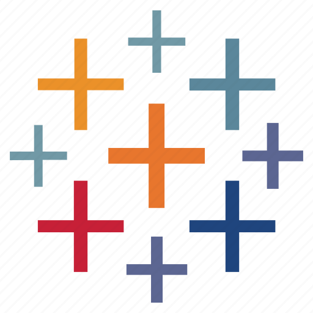

<!--
**kuanchoulai10/kuanchoulai10** is a ✨ _special_ ✨ repository because its `README.md` (this file) appears on your GitHub profile.

Here are some ideas to get you started:

- 🔭 I’m currently working on ...
- 🌱 I’m currently learning ...
- 👯 I’m looking to collaborate on ...
- 🤔 I’m looking for help with ...
- 💬 Ask me about ...
- 📫 How to reach me: ...
- 😄 Pronouns: ...
- ⚡ Fun fact: ...

https://shields.io/
https://simpleicons.org/
https://github.com/tandpfun/skill-icons
https://devicon.dev/

Example GitHub Profile:
- https://github.com/CyrisXD/CyrisXD/blob/master/README.md
-->

# 👋 Hi there 

Welcome! I'm KC (Kuan-Chou), a software engineer with a passion for data, AI, and continuous learning. You can find me at:

  

    
    
    
  

# 🛠️ Personal Projects

### [*Retail Lakehouse with Debezium, Kafka, Iceberg, and Trino*](https://kcl10.com/side-projects/retail-lakehouse/)

### [*Real-time Fraud Detection: from DataOps to MLOps*](https://kcl10.com/side-projects/data2ml-ops/)

### [*Unified SQL-based Data Pipelines on GCP BigQuery*](https://kcl10.com/side-projects/data-mesh/)

See my personal website for more projects and blog posts: [***kcl10.com***](https://kcl10.com)

# 🧰 My Toolbox

### Cloud Platforms

  

### Programming Languages

  

### DevOps

  

### Data & ML

  

    
    
    
    
    
    
    
  

  

    
    
    
    
    
    
  

  

    
    
    
  

  

    
    
    
  

### Databases 

  

    
    
    
  

### API Development

  

    
    
    
    
  

<!-- UV

  

    
  

 -->